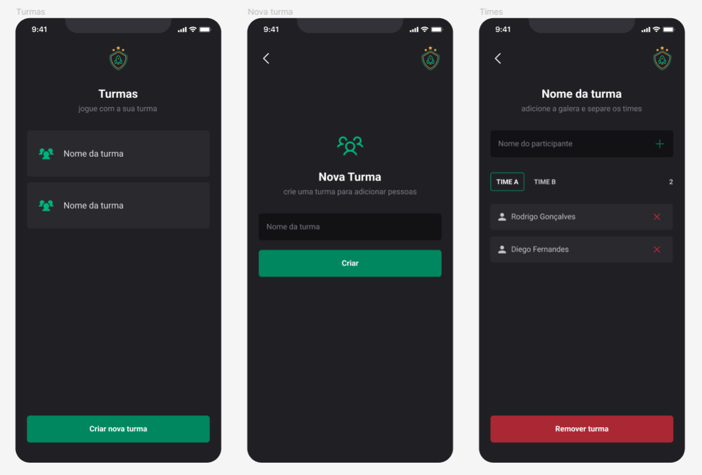

# Criando Interfaces e Navegação - Projeto Ignite Teams

Projeto da trilha de react native da [Rocketseat](https://www.rocketseat.com.br/)

<div align="center">
    
</div>

## 🔮 Aprendizados
- Styled Components
- AsyncStorage
- Stack Navigator - Routes
- Theme
- useFocusEffect
- Class Error

## 🚀 Instalação e uso

Clone o projeto e acesse a pasta

```bash
$ git clone https://github.com/evertonvargas/ignite-rn-02-ignite-teams

```

Siga os passos abaixo
```bash
# Install the dependencies
$ npm i

# Start the project
$ expo start
```